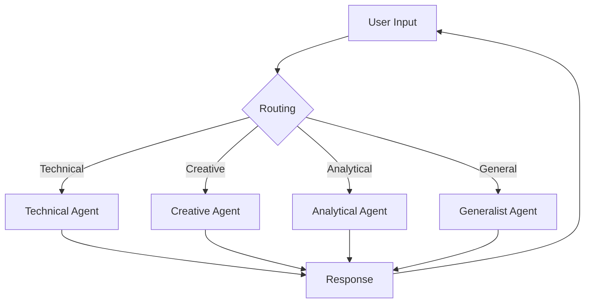

# Multi-Agent Chatbot System


A sophisticated chatbot system that routes queries to specialized AI agents based on the nature of the input, using LangGraph for conversation flow management and Groq's Llama 3 model for high-speed inference.

## Features

- **Specialized Agents**: Four distinct agent types (Generalist, Technical, Creative, Analytical)
- **Smart Routing**: Automatic detection and routing to the most appropriate agent
- **Conversation Memory**: Maintains context throughout the chat session
- **High Performance**: Leverages Groq's ultra-fast inference engine
- **Modular Design**: Easy to extend with new agent types or functionality

## Prerequisites

- Python 3.8+
- Groq API key (free tier available)
- Poetry (recommended) or pip

## Installation

1. Clone the repository:
   ```bash
   git clone https://github.com/yourusername/multi-agent-chatbot.git
   cd multi-agent-chatbot
   ```

2. Set up environment variables:
   ```bash
   echo "GROQ_API_KEY=your_api_key_here" > .env
   ```

3. Install dependencies:
   ```bash
   poetry install  # If using Poetry
   # OR
   pip install -r requirements.txt
   ```

## Usage

Run the chatbot:
```bash
python multi_agent_chatbot.py
```

Example interactions:
```
You: How do I implement quicksort in Python?
[Using technical agent]
AI: Here's a Python implementation of quicksort...

You: Write me a haiku about artificial intelligence
[Using creative agent]
AI: Silicon minds dream...

You: Compare Python and JavaScript for web development
[Using analytical agent]
AI: Here's a structured comparison...
```

## Agent Types

| Agent | Specialization | Example Triggers |
|-------|---------------|------------------|
| Generalist | Everyday questions | "What's the weather?", "Tell me about..." |
| Technical | Programming, technical details | "How does React work?", "Python code for..." |
| Creative | Storytelling, creative writing | "Write a poem about...", "Imagine a world where..." |
| Analytical | Comparisons, structured analysis | "Pros and cons of...", "Compare X and Y" |

## Configuration

Edit `AGENT_ROLES` in the code to modify:
- System prompts for each agent
- Temperature settings
- Model parameters

## Architecture



## Troubleshooting

**Error: API key not found**
- Verify your `.env` file contains `GROQ_API_KEY=your_key_here`
- Ensure you're not committing your `.env` file to version control

**Slow responses**
- Check your internet connection
- Visit Groq's status page for API status

## License

MIT License - See [LICENSE](LICENSE) for details.

## Contributing

Pull requests welcome! Major areas for contribution:
- Adding new agent types
- Improving the routing algorithm
- Enhancing conversation memory

Please open an issue to discuss significant changes.
```

